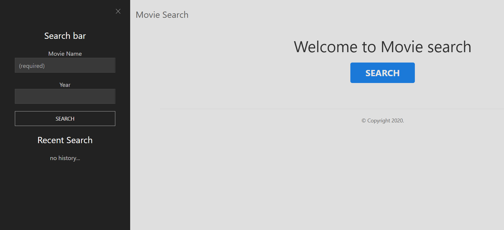

# Group3

This is a Website to search and display movies and their appropriate giphy.

The search is based on the movie name and/or Year to get a list of movies to choose from

This is the layout design of the page using wire framing.

The movie is displayed with related giphy images by its side and some more related movies below it.

## Landing Page

When the web page is opened this is what is displayed.

## To search

To search for a movie click on the search button on the top right corner of the navigation bar.

- The movie can be searched by name or name and year but not only year.

- Your most recent searches are stored in the recent search section where you can click on them and get the information of that movie.

## Result

Once you click on the search button after inputing the name and/or year
This is the result you will get

The giphy is showed beside the main display of the movie information
If you click any of the movies in the related movies section the information of the movie is displayed at the top section of the page.
